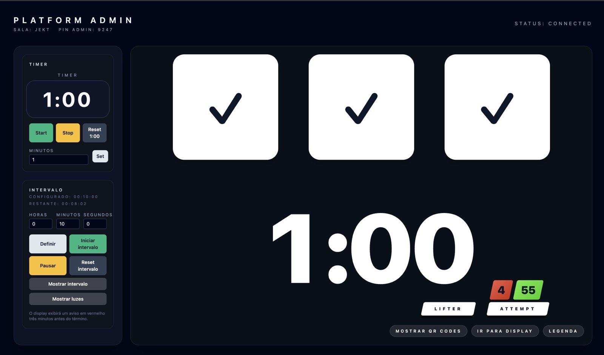

# Referee Lights 1.1

[Português](README.md) · English · [Español](README.es.md)

Complete IPF referee light stack for training sessions and small events. Version **1.1** consolidates multi-session management with admin PIN, dynamic QR codes, and the legend screen. Four web interfaces share the same real-time state via Socket.IO and can be opened on different devices:

- `/` – admin panel that creates/resumes sessions, generates QR codes, controls the timer, and monitors the platform state
- `/display` – full-screen display with the three lights, countdown timer, and interval alerts
- `/legend` – companion board for broadcast/control desk with customizable timer and layout controls
- `/ref/<judge>` – individual consoles (left, center, right) with votes and IPF cards

> The admin panel remains available at `/admin` for backwards compatibility with older links.

Each session has a `roomId` and an admin PIN. The panel automatically generates referee QR codes and direct links for the display/legend, and it can rotate tokens if needed.

## What’s new in 1.1

- Redesigned admin dashboard with descriptive cards, QR code modal with token-rotation confirmation, and quick shortcuts (Display/Legend) to switch between views
- Legend screen connected to the backend with status and error messages, using the same session parameters
- Display layout tweaks: smaller base scale (90%), central timer 15% larger, and reduced bottom padding
- General UX improvements (forms, focus management, copy) and fixes for `POST /rooms` requests

## Screenshots

  
  
  
  
  


## Running locally

### 1. Server (Fastify + Socket.IO)

```bash
cd server
cp .env.example .env
npm install
npm run dev
```

The server listens on `http://localhost:3333`.

### 2. Frontend (Next.js)

```bash
cd ../frontend
cp .env.example .env.local
npm install
npm run dev
```

Open `http://localhost:3000` and navigate to the desired route.

> Adjust `NEXT_PUBLIC_WS_URL` and `NEXT_PUBLIC_API_URL` in `.env.local` to the public server origin when you deploy on a network.

## Admin panel (`/`, also `/admin`)

- **Create new session** – generates `roomId`, admin PIN, referee tokens, and direct display/legend links
- **Join existing session** – reclaims a platform by entering `roomId` + PIN
- **QR Codes** – shows each referee code, with a button to rotate links (confirmation required before revoking current tokens)
- **Ready / Release / Clear** – controls the standard light flow and the 60 s timer
- **Timer** – start/stop/reset plus quick minute adjustments
- **Interval** – schedules downtime, toggles between red warning and main panel

### Visual and audio alerts

- The interval countdown plays short beeps during the last 10 s and a long tone at zero. After 1 s the message `OPENER CHANGES CLOSED` (localized) replaces the red overlay.
- The main timer also beeps during the last 10 s and plays three quick tones on the final second.
- Browser autoplay rules require one user interaction (click/keypress) before sounds play.

## Suggested workflow

1. Open `/`, create a new session, and copy `roomId`/PIN.
2. Load the display at `/display?roomId=ABCD&pin=1234` and enable fullscreen.
3. Share the QR codes with referees (each one opens their respective console).
4. To rotate the crew, open the QR modal and confirm “Generate new links”.
5. Use the “Legend” button to open the companion screen (`/legend?roomId=ABCD&pin=1234`).
6. Typical flow: Ready → referees vote → Release → decision revealed → Clear.

## Quick customization

- Adjust the default timer by editing `INITIAL_TIMER` in `server/src/state.ts`.
- Change token settings/expiration in `server/src/rooms.ts` within `RoomManager`.
- Admin panel UI lives in `frontend/src/pages/admin.tsx`.
- Display scaling and timer layout live in `frontend/src/pages/display.tsx` and `frontend/src/components/TimerDisplay.tsx`.
- Audio cues are handled in `frontend/src/components/IntervalFull.tsx`.

## External shortcuts (F1/F10)

To integrate with scoreboards that expect keyboard shortcuts, use the helper in `tools/key-relay`. Run `start.command` (macOS), `start.bat`/`start.ps1` (Windows), or `start.sh` (Linux), paste the session link (display/admin), and optionally override the shortcut keys. The helper stays connected via Socket.IO and sends:

- `F1` when at least two white lights (good lift) are registered
- `F10` when at least two red lights (no lift) are registered

The helper only requires Node 18+. Full instructions (including OS permissions) are in `tools/key-relay/README.md`. Keep it running on the machine that will emit the keystrokes, even if the backend is hosted elsewhere.

## Deploy

- **Server**: any Node 18+ environment (e.g., EasyPanel). Run `npm run build` and then `npm start`.
- **Frontend**: Vercel or similar. Configure `NEXT_PUBLIC_WS_URL` and `NEXT_PUBLIC_API_URL` with the server domain. Use `NEXT_PUBLIC_QR_ORIGIN` (e.g., `luzes-ipf.assist.com.br`) to force QR codes to share a fixed public origin.
- **Windows bundle**: a script builds a portable package (backend + frontend + scripts) under `dist/windows-bundle`. See [docs/windows-package.md](docs/windows-package.md) for details.
