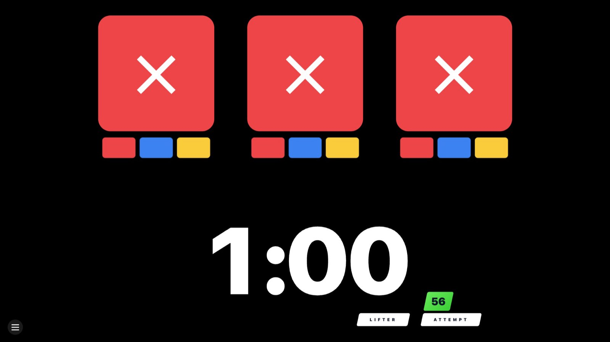
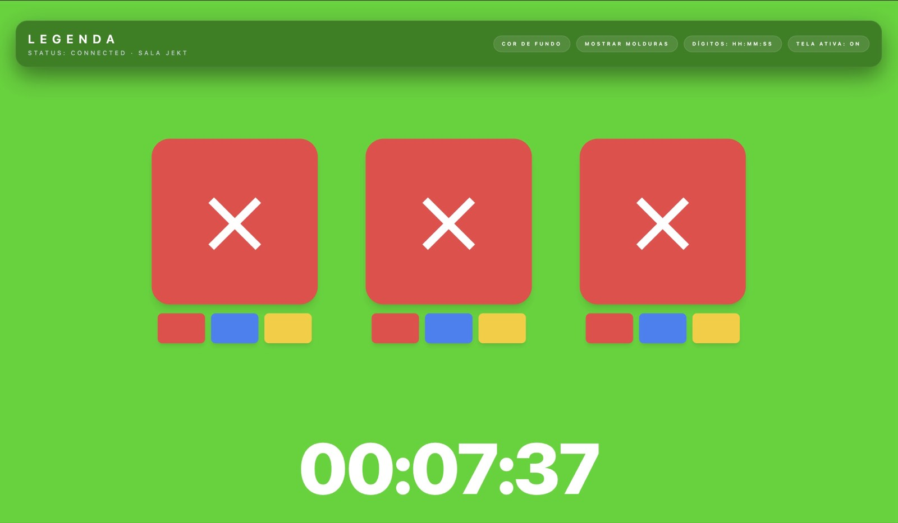

# Referee Lights 1.1

  

[Português](README.md) · [English](README.en.md) · Español

Plataforma completa de luces IPF para entrenamientos y eventos pequeños. La versión **1.1** consolida la gestión multi-sesión con PIN administrativo, códigos QR dinámicos y la pantalla de leyenda. Cuatro interfaces web comparten el mismo estado en tiempo real mediante Socket.IO y pueden abrirse en distintos dispositivos:

- `/` – panel administrativo que crea/recupera sesiones, genera códigos QR, controla el temporizador y sigue el estado de la plataforma
- `/display` – pantalla a tamaño completo con las tres luces, cronómetro y avisos de intervalo
- `/legend` – tablero complementario para transmisión/mesa técnica con temporizador personalizable y controles de diseño
- `/ref/<judge>` – consolas individuales (left, center, right) con votos y tarjetas IPF

> El panel administrativo sigue disponible en `/admin` para mantener la compatibilidad con enlaces antiguos.

Cada sesión tiene `roomId` y PIN administrativo. El panel genera automáticamente los códigos QR de los árbitros y enlaces directos para la pantalla/leyenda, además de permitir rotar los tokens cuando sea necesario.

> Recomendación: utilice la pantalla principal en monitores Full HD (1920x1080) para conservar el diseño y las proporciones originales.

## Novedades de la 1.1

- Rediseño del panel admin con tarjetas descriptivas, modal de códigos QR con confirmación para rotar tokens y accesos rápidos (Display/Legend) para alternar entre vistas
- Pantalla de leyenda conectada al backend con mensajes de estado y error, reutilizando los parámetros de la sesión
- Ajustes de diseño en la pantalla principal: escala base menor (90 %), cronómetro central 15 % más grande y padding inferior reducido
- Mejoras generales de UX (formularios, foco, copys) y correcciones en las solicitudes `POST /rooms`

## Capturas

  
  
  
  
  


## Ejecución local

### 1. Servidor (Fastify + Socket.IO)

```bash
cd server
cp .env.example .env
npm install
npm run dev
```

El servidor escucha en `http://localhost:3333`.

### 2. Frontend (Next.js)

```bash
cd ../frontend
cp .env.example .env.local
npm install
npm run dev
```

Ingrese a `http://localhost:3000` y navegue a la ruta deseada.

> Ajuste `NEXT_PUBLIC_WS_URL` y `NEXT_PUBLIC_API_URL` en `.env.local` apuntando al origen público del servidor al desplegar en red.

## Panel admin (`/`, también `/admin`)

- **Crear nueva sesión** – genera `roomId`, PIN administrativo, tokens de árbitros y enlaces directos para display/legend
- **Incorporarse a una sesión existente** – recupera la plataforma ingresando `roomId` + PIN
- **Códigos QR** – muestra cada código de árbitro, con botón para rotar enlaces (pide confirmación antes de revocar los tokens actuales)
- **Ready / Release / Clear** – controla el flujo estándar de luces y el temporizador de 60 s
- **Timer** – iniciar/detener/restablecer y ajuste rápido de minutos
- **Intervalo** – programa el tiempo de cambio, alternando entre aviso rojo y panel principal

### Alertas visuales y sonoras

- El contador de intervalo reproduce bips cortos en los últimos 10 s y un tono largo en cero. Tras 1 s el mensaje localizable sustituye la superposición roja.
- El cronómetro principal también avisa en los últimos 10 s y emite tres bips rápidos en el segundo final.
- Por las reglas de los navegadores, los sonidos se habilitan únicamente después de una interacción del usuario (clic/tecla).

## Flujo sugerido

1. Abra `/`, cree una sesión nueva y copie `roomId`/PIN.
2. Cargue la pantalla en `/display?roomId=ABCD&pin=1234` y active el modo de pantalla completa.
3. Comparta los códigos QR con los árbitros (cada uno abre su consola correspondiente).
4. Para rotar al equipo, abra el modal de códigos QR y confirme “Generar nuevos enlaces”.
5. Use el botón “Legend” para abrir la pantalla complementaria (`/legend?roomId=ABCD&pin=1234`).
6. Flujo típico: Ready → los árbitros votan → Release → se muestra la decisión → Clear.

## Personalización rápida

- Ajuste el tiempo por defecto editando `INITIAL_TIMER` en `server/src/state.ts`.
- Cambie configuración/expiración de tokens en `server/src/rooms.ts` dentro de `RoomManager`.
- El panel admin está en `frontend/src/pages/admin.tsx`.
- Escala del display y diseño del cronómetro en `frontend/src/pages/display.tsx` y `frontend/src/components/TimerDisplay.tsx`.
- Alertas de audio en `frontend/src/components/IntervalFull.tsx`.

## Atajos externos (F1/F10)

Para integrarse con tableros que esperan atajos de teclado, use el helper en `tools/key-relay`. Ejecute `start.command` (macOS), `start.bat`/`start.ps1` (Windows) o `start.sh` (Linux), pegue el enlace de la sesión (display/admin) y, opcionalmente, personalice las teclas. El helper se mantiene conectado por Socket.IO y envía:

- `F1` cuando se registran al menos dos luces blancas (válido)
- `F10` cuando se registran al menos dos luces rojas (no válido)

El helper solo requiere Node 18+. Las instrucciones completas (incluyendo permisos del sistema operativo) están en `tools/key-relay/README.md`. Debe ejecutarse en la máquina que enviará las teclas, incluso si el backend está alojado en la nube.

## Deploy

- **Servidor**: cualquier entorno Node 18+ (por ejemplo, EasyPanel). Ejecute `npm run build` y luego `npm start`.
- **Frontend**: Vercel o similar. Configure `NEXT_PUBLIC_WS_URL` y `NEXT_PUBLIC_API_URL` con el dominio del servidor. Use `NEXT_PUBLIC_QR_ORIGIN` (ej.: `luzes-ipf.assist.com.br`) para forzar que los códigos QR compartan un origen público fijo.
- **Paquete Windows**: un script genera un paquete portátil (backend + frontend + scripts) en `dist/windows-bundle`. Consulte [docs/windows-package.md](docs/windows-package.md).
