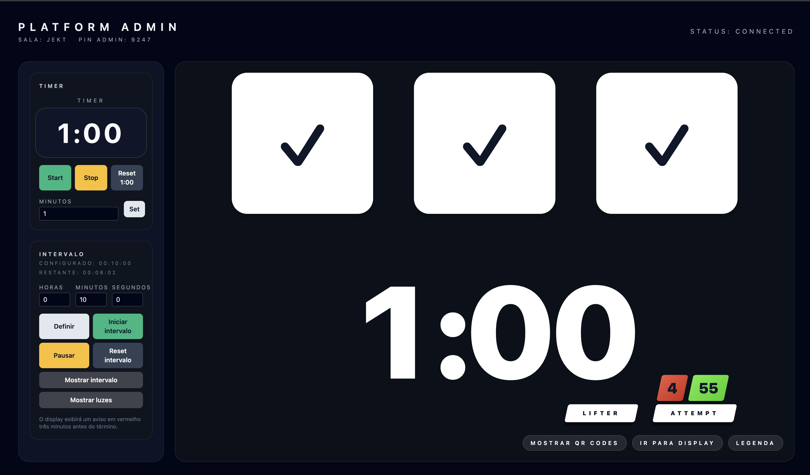
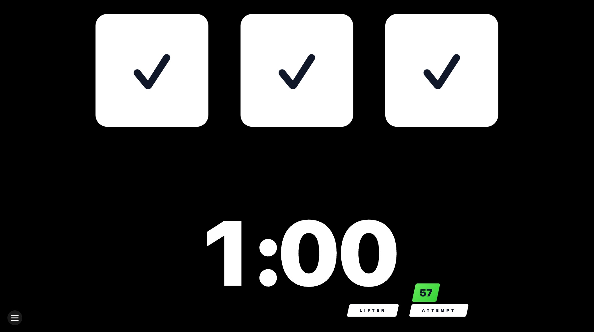
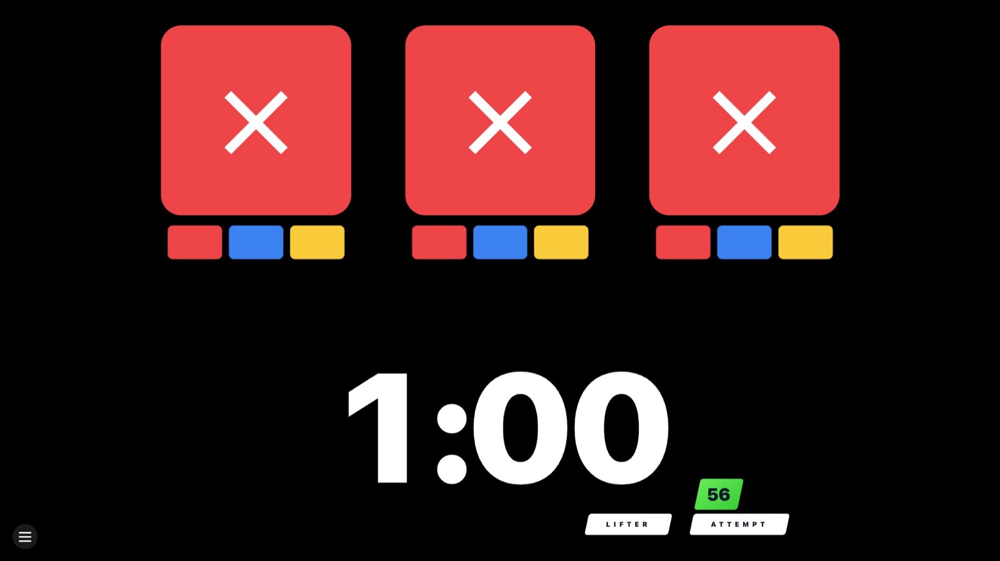
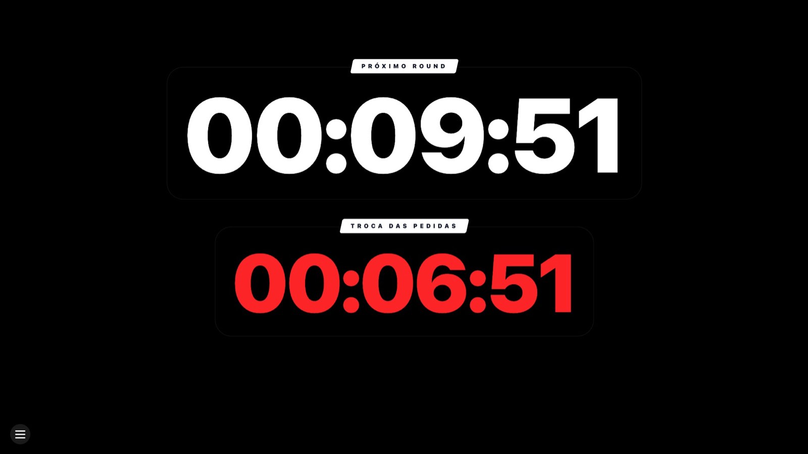
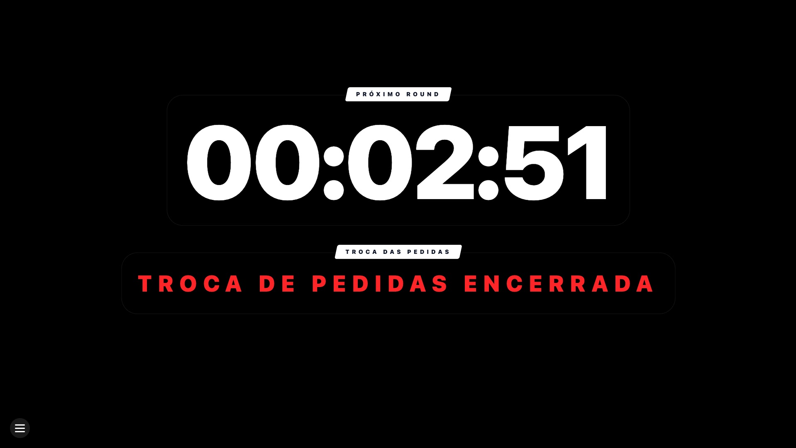
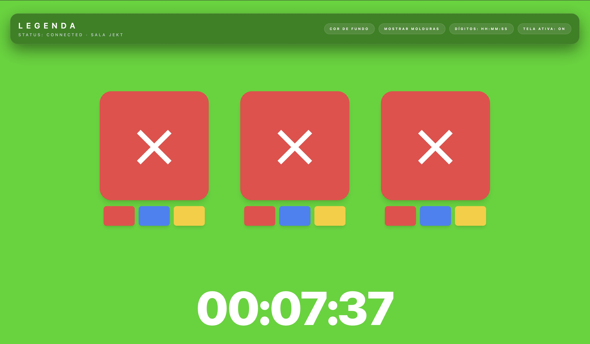

# Referee Lights 1.2

  

Português · [English](README.en.md) · [Español](README.es.md)

Plataforma completa de luzes IPF para treinos e eventos menores. A versão **1.2** traz escalonamento responsivo em todas as telas, suporte a PWA e a página de timer redesenhada. Cinco interfaces web compartilham o mesmo estado em tempo real via Socket.IO e podem ser abertas em diferentes dispositivos:

- `/` – painel administrativo que cria/recupera sessões, gera QR Codes, controla o timer e acompanha o estado da plataforma
- `/display` – display em tela cheia com as três luzes, cronômetro, intervalo e badges de cooldown
- `/timer` – painel de controle autônomo para timer/intervalo com badges de cooldown
- `/legend` – painel complementar para transmissão/mesa técnica com layout personalizável
- `/ref/<judge>` – consoles individuais (left, center, right) com votos e cartões IPF

> O painel administrativo continua acessível em `/admin` para compatibilidade com links antigos.

Cada sessão possui `roomId` e PIN. O painel gera automaticamente os QR Codes dos árbitros e links de exibição/legenda, além de permitir a rotação dos tokens quando necessário.

## Novidades da 1.2

- **Escalonamento responsivo de viewport** – todas as telas (admin, display, timer, referee) se ajustam automaticamente a qualquer tamanho de tela; sem controles manuais de zoom no display; painel admin escala proporcionalmente em janelas menores; consoles de árbitros funcionam em qualquer smartphone sem ajuste manual
- **Suporte a PWA** – Web App Manifest com display standalone; apple-mobile-web-app-capable para iOS; salva a URL atual (com roomId/token) na tela inicial; ícone SVG com design de luzes de árbitros
- **Timer standalone redesenhado** (`/timer`) – agora é um painel de controle completo (não apenas exibição); cards de Timer + Intervalo lado a lado (paisagem) ou empilhados (retrato); badges de cooldown mostrando tempo de troca; escalonamento responsivo
- **Footer auto-hide ao rolar** – componente FooterBadges oculta durante scroll, reaparecendo após 1,5 s
- **Melhorias nos badges de cooldown** – largura fixa (tabular-nums), posicionados de forma absoluta acima das placas LIFTER/ATTEMPT (sem shift de layout), hook `useCooldownBadges` exportado para reuso
- **Key Relay integrado ao servidor** – não é mais necessário um processo auxiliar separado. O painel admin possui um toggle "Ativar Key Relay" que inicia/para o key relay diretamente pelo navegador. Suporta qualquer combinação de teclas (F1–F12, Ctrl+tecla, Alt+tecla, etc.) configurável via modal que captura pressionamentos de tecla


## Screenshots








## Rodar no Windows (sem instalação)

1. Baixe o arquivo `referee-lights-windows.zip` na página de [Releases](https://github.com/jeanribas/luzes-de-arbitros-ipf/releases)
2. Clique com o botão direito → **Extrair tudo...**
3. Abra a pasta extraída e dê duplo-clique em **Iniciar.cmd**
4. O navegador abrirá automaticamente com a plataforma
5. Compartilhe os QR Codes com os árbitros (mesma rede Wi-Fi)

Para encerrar, pressione qualquer tecla na janela do Iniciar.

## Executando localmente

### 1. Server (Fastify + Socket.IO)
```bash
cd server
cp .env.example .env
npm install
npm run dev
```
O servidor sobe em `http://localhost:3333`.

### 2. Frontend (Next.js)
```bash
cd ../frontend
cp .env.example .env.local
npm install
npm run dev
```
Aponte o navegador para `http://localhost:3000` nas rotas desejadas.

> Ajuste `NEXT_PUBLIC_WS_URL` e `NEXT_PUBLIC_API_URL` no `.env.local` para o endereço público do servidor quando estiver em rede.

## Variáveis de ambiente

### Server (.env)
| Variável | Descrição | Padrão |
|---|---|---|
| `PORT` | Porta do servidor | `3333` |
| `CORS_ORIGIN` | Origens permitidas | — |
| `LOG_LEVEL` | Nível de log (debug, info, warn, error) | `info` |
| `TELEMETRY_ENABLED` | Ativar/desativar telemetria | `true` |
| `ANALYTICS_DB_PATH` | Caminho do banco analítico | `data/analytics.db` |

## Painel `/` (Admin)

- **Criar nova sessão** – gera `roomId`, PIN administrativo, tokens dos árbitros e links diretos de display/legenda
- **Entrar em sessão existente** – retoma uma plataforma informando `roomId` + PIN
- **QR Codes** – exibe os códigos de cada árbitro, com botão para gerar novos links (pede confirmação antes de revogar os tokens atuais)
- **Ready / Release / Clear** – controla o fluxo padrão das luzes e o timer de 60 s
- **Timer** – start/stop/reset e ajuste rápido de minutos
- **Intervalo** – programa tempo de troca, alterna entre aviso vermelho e painel principal

### Alertas visuais e sonoros
- O contador do intervalo emite toques curtos nos últimos 10 s e um sinal longo quando o tempo de troca atinge zero. Após 1 s, a mensagem `TROCA DE PEDIDAS ENCERRADA` substitui o display vermelho.
- O cronômetro principal também sinaliza os últimos 10 s com bipes curtos e dispara três beeps rápidos no segundo final.
- Por regras dos navegadores, os sons só tocam depois que o operador interage com a página (clique/tecla).

## Fluxo sugerido
1. Acesse `/`, crie uma nova sessão e copie o `roomId`/PIN.
2. Abra o display em `/display?roomId=ABCD&pin=1234` e coloque em tela cheia.
3. Compartilhe os QR Codes com os árbitros (cada um abre o console apropriado).
4. Se precisar rotacionar a equipe, abra o modal de QR Codes e confirme "Gerar novos links".
5. Use o botão "Legenda" para abrir a tela complementar (`/legend?roomId=ABCD&pin=1234`).
6. Fluxo padrão: Ready → árbitros votam → Release → decisão exibida → Clear.

## Personalização rápida
- Ajuste o tempo padrão editando `INITIAL_TIMER` em `server/src/state.ts`.
- Para alterar tokens/tempo de expiração, veja `server/src/rooms.ts` e `RoomManager`.
- Aparência do painel admin em `frontend/src/pages/admin.tsx`.
- Ajustes de escala do display/cronômetro em `frontend/src/pages/display.tsx` e `frontend/src/components/TimerDisplay.tsx`.
- Alertas sonoros em `frontend/src/components/IntervalFull.tsx`.

## Atalhos externos (F1/F10)

A forma recomendada é usar o toggle **"Ativar Key Relay"** no painel admin. Ele inicia/para o key relay diretamente pelo navegador, sem processos auxiliares. Um modal permite capturar qualquer combinação de teclas (F1–F12, Ctrl+tecla, Alt+tecla, etc.) para personalizar os atalhos.

Para uso avançado, o helper independente em `tools/key-relay` continua disponível. Basta abrir `start.command` (macOS), `start.bat`/`start.ps1` (Windows) ou `start.sh` (Linux), colar o link da sessão (display/admin) e informar opcionalmente as teclas de atalho. Ele acompanha a sala via Socket.IO e dispara:

- `F1` quando houver pelo menos dois votos brancos (válido);
- `F10` quando houver pelo menos dois votos vermelhos (inválido).

O helper só precisa de Node 18+ instalado. As instruções completas (incluindo permissões específicas de cada sistema) estão em `tools/key-relay/README.md`. Ele deve rodar na máquina que enviará as teclas, mesmo quando o backend estiver hospedado na web.

## Deploy
- **Server**: qualquer ambiente Node 18+ (ex.: EasyPanel). Basta `npm run build` e `npm start`.
- **Frontend**: Vercel ou semelhante. Configure `NEXT_PUBLIC_WS_URL` e `NEXT_PUBLIC_API_URL` apontando para o domínio do servidor.
- **Docker**: monte um volume em `/app/data` para persistir os dados.
