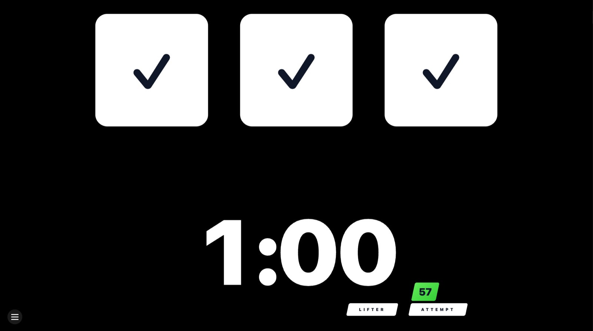

# Referee Lights 1.1

  

Português · [English](README.en.md) · [Español](README.es.md)

Plataforma completa de luzes IPF para treinos e eventos menores. A versão **1.1** consolida o fluxo multi-sessão com PIN administrativo, QR Codes dinâmicos e a nova tela de legenda. Quatro interfaces web compartilham o mesmo estado em tempo real via Socket.IO e podem ser abertas em diferentes dispositivos:

- `/` – painel administrativo que cria/recupera sessões, gera QR Codes, controla o timer e acompanha o estado da plataforma
- `/display` – display em tela cheia com as três luzes, cronômetro e avisos de intervalo
- `/legend` – painel complementar para transmissão/mesa técnica com timer personalizável e controles de layout
- `/ref/<judge>` – consoles individuais (left, center, right) com votos e cartões IPF

> O painel administrativo continua acessível em `/admin` para compatibilidade com links antigos.

Cada sessão possui `roomId` e PIN. O painel gera automaticamente os QR Codes dos árbitros e links de exibição/legenda, além de permitir a rotação dos tokens quando necessário.

> Recomendação: utilize o display principal em telas Full HD (1920x1080) para manter o layout e as proporções originais.

## Novidades da 1.1

- Redesign do painel admin com cartões descritivos, modal de QR Codes com confirmação para rotação de tokens e atalhos rápidos (Display/Legenda) para alternar entre telas
- Tela de legenda conectada ao backend com status e mensagens de erro, usando os mesmos parâmetros da sessão
- Ajustes de layout no display: escala base menor (90%), cronômetro central 15% maior e padding inferior removido
- Melhorias de UX gerais (formulários, foco, cópia) e correções nas requisições `POST /rooms`

## Screenshots





## Executando localmente

### 1. Server (Fastify + Socket.IO)
```bash
cd server
cp .env.example .env
npm install
npm run dev
```
O servidor sobe em `http://localhost:3333`.

### 2. Frontend (Next.js)
```bash
cd ../frontend
cp .env.example .env.local
npm install
npm run dev
```
Aponte o navegador para `http://localhost:3000` nas rotas desejadas.

> Ajuste `NEXT_PUBLIC_WS_URL` e `NEXT_PUBLIC_API_URL` no `.env.local` para o endereço público do servidor quando estiver em rede.

## Painel `/` (Admin)

- **Criar nova sessão** – gera `roomId`, PIN administrativo, tokens dos árbitros e links diretos de display/legenda
- **Entrar em sessão existente** – retoma uma plataforma informando `roomId` + PIN
- **QR Codes** – exibe os códigos de cada árbitro, com botão para gerar novos links (pede confirmação antes de revogar os tokens atuais)
- **Ready / Release / Clear** – controla o fluxo padrão das luzes e o timer de 60 s
- **Timer** – start/stop/reset e ajuste rápido de minutos
- **Intervalo** – programa tempo de troca, alterna entre aviso vermelho e painel principal

### Alertas visuais e sonoros
- O contador do intervalo emite toques curtos nos últimos 10 s e um sinal longo quando o tempo de troca atinge zero. Após 1 s, a mensagem `TROCA DE PEDIDAS ENCERRADA` substitui o display vermelho.
- O cronômetro principal também sinaliza os últimos 10 s com bipes curtos e dispara três beeps rápidos no segundo final.
- Por regras dos navegadores, os sons só tocam depois que o operador interage com a página (clique/tecla).

## Fluxo sugerido
1. Acesse `/`, crie uma nova sessão e copie o `roomId`/PIN.
2. Abra o display em `/display?roomId=ABCD&pin=1234` e coloque em tela cheia.
3. Compartilhe os QR Codes com os árbitros (cada um abre o console apropriado).
4. Se precisar rotacionar a equipe, abra o modal de QR Codes e confirme “Gerar novos links”.
5. Use o botão “Legenda” para abrir a tela complementar (`/legend?roomId=ABCD&pin=1234`).
6. Fluxo padrão: Ready → árbitros votam → Release → decisão exibida → Clear.

## Personalização rápida
- Ajuste o tempo padrão editando `INITIAL_TIMER` em `server/src/state.ts`.
- Para alterar tokens/tempo de expiração, veja `server/src/rooms.ts` e `RoomManager`.
- Aparência do painel admin em `frontend/src/pages/admin.tsx`.
- Ajustes de escala do display/cronômetro em `frontend/src/pages/display.tsx` e `frontend/src/components/TimerDisplay.tsx`.
- Alertas sonoros em `frontend/src/components/IntervalFull.tsx`.

## Atalhos externos (F1/F10)

Para integrar com placares que esperam atalhos de teclado, use o helper independente em `tools/key-relay`. Basta abrir `start.command` (macOS), `start.bat`/`start.ps1` (Windows) ou `start.sh` (Linux), colar o link da sessão (display/admin) e informar opcionalmente as teclas de atalho. Ele acompanha a sala via Socket.IO e dispara:

- `F1` quando houver pelo menos dois votos brancos (válido);
- `F10` quando houver pelo menos dois votos vermelhos (inválido).

O helper só precisa de Node 18+ instalado. As instruções completas (incluindo permissões específicas de cada sistema) estão em `tools/key-relay/README.md`. Ele deve rodar na máquina que enviará as teclas, mesmo quando o backend estiver hospedado na web.

## Deploy
- **Server**: qualquer ambiente Node 18+ (ex.: EasyPanel). Basta `npm run build` e `npm start`.
- **Frontend**: Vercel ou semelhante. Configure `NEXT_PUBLIC_WS_URL` e `NEXT_PUBLIC_API_URL` apontando para o domínio do servidor.
  Se quiser forçar os QR Codes a usarem um domínio fixo, defina também `NEXT_PUBLIC_QR_ORIGIN` (ex.: `luzes-ipf.assist.com.br`).
- **Pacote Windows**: há um script que gera um bundle portátil (backend + frontend + scripts) em `dist/windows-bundle`. Veja [docs/windows-package.md](docs/windows-package.md).
